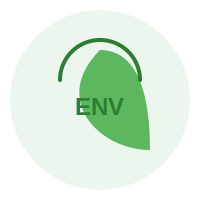

# good-env

<p align="center">
  
</p>


[](https://github.com/standard/semistandard)

🚨 v7 requires Node version 18.20.4 or higher! 🚨

# good-env

A more intuitive way to work with environment variables in Node.js applications.

[](https://www.npmjs.com/package/good-env)
[](https://opensource.org/licenses/MIT)

## Why good-env?

When building non-trivial applications, working with environment variables as raw strings can be limiting. `good-env` provides:

- Type conversion (strings to numbers, booleans, lists, etc.)
- Default values
- Existence checking
- Validation
- No production dependencies

## Installation

```bash
npm install good-env --save
```

## Usage

### Basic Usage

Import the package:

```javascript
const env = require('good-env');
```

### Getting Values

#### Simple Values

```javascript
// Get a string (default behavior)
env.get('HOST');                    // 'localhost'

// With a default value if not set
env.get('NOT_SET', 'default');      // 'default'
```

#### Type Conversion

```javascript
// Get as a number
env.getNumber('PORT');              // 8080 (as a number, not string)
env.num('PORT');                    // Shorthand for getNumber()

// Get as a boolean
env.getBool('DEBUG');               // true (converts 'true' string to boolean)
env.bool('DEBUG');                  // Shorthand for getBool()

// Get as a list
env.getList('ALLOWED_ORIGINS');     // ['localhost', 'example.com']
env.list('ALLOWED_ORIGINS');        // Shorthand for getList()

// Get a numeric list
env.list('VALUES', { cast: 'number' }); // [1, 2, 3] (converts from '1,2,3')
```

#### URLs and IPs

```javascript
// Get as a URL object
env.getUrl('API_ENDPOINT');         // Returns URL object with helpful properties
env.url('API_ENDPOINT');            // Shorthand for getUrl()

// Get an IP address (with validation)
env.getIp('SERVER_IP', '127.0.0.1'); // Returns the IP if valid, or default
```

### Multiple Variables

#### First Available Value

```javascript
// Use first available variable from a list
env.get(['PRIMARY_HOST', 'BACKUP_HOST', 'DEFAULT_HOST']);

// With default fallback
env.get(['PRIMARY_HOST', 'BACKUP_HOST'], 'localhost');
```

#### Batch Operations

```javascript
// Get multiple values as an array
env.getAll(['SECRET', 'HOST', 'PORT']);

// Get multiple values as an object with defaults
env.getAll({
  API_KEY: null,         // null means no default
  PORT: 3000,            // Default if not set
  DEBUG: false
});
```

### Validation

#### Existence Checking

```javascript
// Check if variables exist
env.ok('HOST');                     // true if HOST exists
env.ok('HOST', 'PORT', 'API_KEY');  // true if ALL exist
```

#### Assertions

```javascript
// Validate variables (throws error if invalid)
env.assert(
  // Simple existence check
  'HOST',
  
  // Type checking
  { PORT: { type: 'number' }},
  
  // Custom validation
  { REFRESH_INTERVAL: { 
      type: 'number', 
      ok: val => val >= 1000 
    }
  }
);
```

### AWS Credentials

```javascript
// Get AWS credentials from standard environment variables
const {
  awsKeyId,
  awsSecretAccessKey,
  awsSessionToken,
  awsRegion
} = env.getAWS();

// With default region
const credentials = env.getAWS({ region: 'us-west-2' });
```

### AWS Secrets Manager Integration

Some folks like to store secrets in AWS secrets manager in the form of a JSON object as opposed to environment variables. It's me, I'm some folks. Good Env now supports this pattern. To avoid introducing a dependency you'll have to bring your own instance of AWS Secrets Manager though. Be sure to specify your AWS region as an environment variable, otherwise, it'll default to `us-east-1`.

Note, if something goes wrong, this function _will_ throw an error.

```javascript
const awsSecretsManager = require('@aws-sdk/client-secrets-manager');

(async function() {
  // Load secrets from AWS Secrets Manager
  await env.use(awsSecretsManager, 'my-secret-id');

  // The secret ID can also be specified via environment variables
  // AWS_SECRET_ID or SECRET_ID
  await env.use(awsSecretsManager);

  // Secrets are automatically merged with existing environment variables
  // and can be accessed using any of the standard methods
  const secretValue = env.get('someSecretFromAWSSecretsManager');
}());
```

## Important Behavior Notes

### Boolean Existence vs Value

When checking for the existence of a boolean environment variable:

```javascript
// If A_BOOL_VAL=false
env.ok('A_BOOL_VAL');   // Returns true (checking existence, not value)
env.getBool('A_BOOL_VAL'); // Returns false (actual value)
```

### URL Validation

- `getUrl()` only supports 'http', 'https', 'redis', and 'postgresql' protocols
- Invalid URLs return `null` instead of throwing errors
- Using `getUrl()` ensures proper URL format

## Examples

### Complete Configuration Setup

```javascript
// app-config.js
const env = require('good-env');

// Validate critical variables
env.assert(
  'DATABASE_URL',
  { PORT: { type: 'number' }}
);

module.exports = {
  port: env.num('PORT', 3000),
  database: env.url('DATABASE_URL'),
  debug: env.bool('DEBUG', false),
  allowedOrigins: env.list('ALLOWED_ORIGINS', 'localhost'),
  cache: {
    enabled: env.bool('CACHE_ENABLED', true),
    ttl: env.num('CACHE_TTL', 3600)
  }
};
```

## License

MIT
